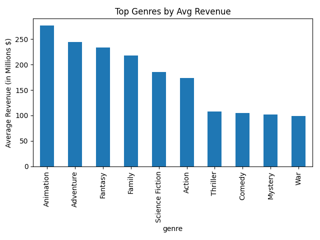
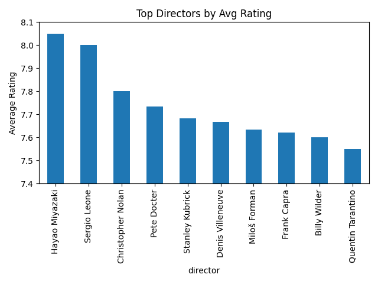
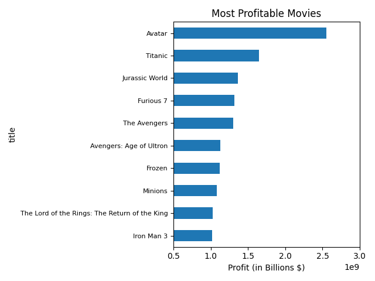
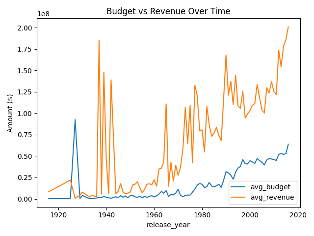

# TMDB Movie Analysis - SQL Practice Project

SQL-focused exploratory analysis on the TMDB 5000 Movie Dataset from Kaggle,
covering joins, JSON flattening, and aggregate queries to explore genre performance,
director rankings, and profitability trends.

---

## Dataset
- **Source:** [TMDB 5000 Movie Dataset - Kaggle](https://www.kaggle.com/datasets/tmdb/tmdb-movie-metadata)
- **Size:** ~4,800 movies | 2 files (movies metadata + credits)
- `tmdb_5000_movies.csv` — budget, revenue, genres, ratings, release dates
- `tmdb_5000_credits.csv` — cast and crew per movie

---

## Questions Explored
1. What are the top 10 highest-grossing genres?
2. Which directors have the highest average rating (min. 3 films)?
3. Which actors appear together most frequently?
4. What are the most profitable movies (revenue − budget), excluding missing data?
5. How has average movie budget/revenue changed over time?

---

## Key Findings
- The **Animation** genre generates the highest average revenue despite not having the most releases
- budgets have risen sharply since **1969**
- The Top Director by Average Rating was **Hayao Miyazaki**
- The actor pairs who have appeared together most frequently together were **Adam Sandler & Allen Covert**
- **Avatar** was the most profitable movie

---

## SQL Concepts Practiced
- Multi-table joins (`movies` ⨝ `credits`)
- Parsing/flattening JSON columns (genres, cast, crew) into relational tables
- Aggregate functions (`AVG`, `SUM`, `COUNT`) with `GROUP BY` / `HAVING`
- Window functions for rankings
- Handling dirty data (zero-value budgets/revenue as missing data)

---

## Visuals

---

## How to Run
1. Clone the repo
   git clone https://github.com/codexyz1/tmdb-sql-project.git

2. Install dependencies
   pip install -r requirements.txt

3. Load the data into SQLite
   jupyter notebook notebooks/01_setup_load_data.ipynb

4. Run SQL queries directly
   sql/queries/*.sql
   (or open notebooks/03_analysis_queries.ipynb for results + charts)

---

## Tools Used
- SQLite
- Python 3.13
- Pandas
- Matplotlib
- Jupyter Notebook

---

## About Me
Hi, I'm Abdalla — a Computer Science student at UAEU interested in Data Analysis and AI integration.

- 🔗 [LinkedIn](https://www.linkedin.com/in/abdalla-al-awadhi-53338a221/)
- 🐙 [GitHub](https://github.com/codexyz1)